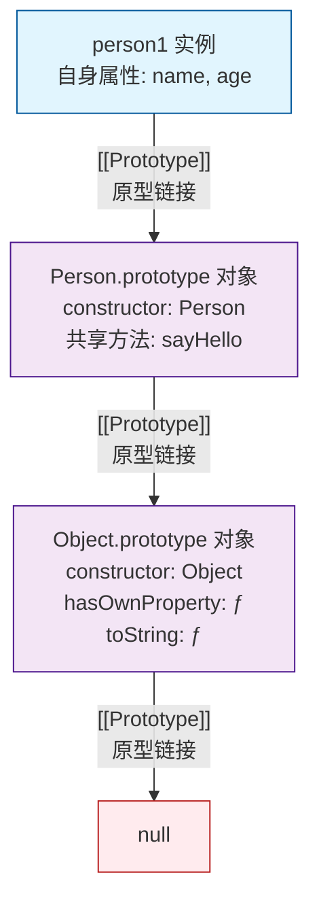
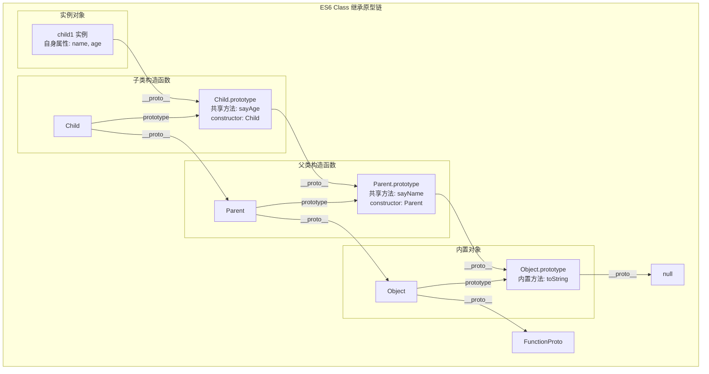

理解 JavaScript 的原型、原型链、构造函数和继承是掌握这门语言的关键。

<!--more-->

# 🧬 JavaScript 面向对象核心：原型、原型链与继承

## 1. 概述

JavaScript 采用**原型继承** (Prototype-based Inheritance) 来实现面向对象编程（OOP），这与基于类的语言（如 Java）有所不同。其核心在于**每个对象都包含一个指向另一个对象（其原型）的内部链接**，从而形成一条**原型链** (Prototype Chain)。当访问对象的属性或方法时，若对象自身不存在该成员，引擎会**沿原型链向上查找**，直至找到或抵达链的末端（`null`）。

为了让你快速建立整体认知，下面用一个表格概括这些核心概念：

| 概念         | 描述                                           | 关键点                                                             |
| :----------- | :--------------------------------------------- | :----------------------------------------------------------------- |
| **构造函数** | 用于创建和初始化对象的函数                     | 通常首字母大写；通过 `new` 调用；内部 `this` 指向新实例。          |
| **原型**     | 每个函数都有的 `prototype` 属性，指向一个对象  | 实例会共享原型上的属性和方法；用于方法存储，节省内存。             |
| **原型链**   | 由对象通过 `__proto__` 链接形成的链式结构      | 实现继承的基础；属性查找沿链向上直至找到或到终点。                 |
| **继承**     | 使一个对象能够访问另一个对象的属性和方法的机制 | 在 JS 中主要通过原型链实现；ES6 的 `class` 和 `extends` 是语法糖。 |

## 2. 构造函数 (Constructor)

构造函数是用于**创建和初始化对象**的特殊函数。

- 通过 `new` 关键字调用构造函数会执行以下步骤：
  1.  创建一个新的空对象。
  2.  将新对象的 `__proto__` 指向构造函数的 `prototype` 属性，从而建立原型链。
  3.  将构造函数内部的 `this` 绑定到这个新对象。
  4.  执行构造函数内部的代码（通常用于初始化属性）。
  5.  如果构造函数没有显式返回其他对象，则默认返回这个新对象。

```javascript
function Person(name, age) {
  // 构造函数通常首字母大写
  this.name = name; // 初始化实例属性
  this.age = age;
}

// 在构造函数的原型上添加方法，所有实例可共享
Person.prototype.sayHello = function () {
  console.log(`Hello, my name is ${this.name} and I am ${this.age} years old.`);
};

const person1 = new Person("Alice", 30); // 使用 new 创建实例
const person2 = new Person("Bob", 25);

person1.sayHello(); // Hello, my name is Alice and I am 30 years old.
person2.sayHello(); // Hello, my name is Bob and I am 25 years old.
```

## 3. 原型 (Prototype) 与原型链 (Prototype Chain)

### 3.1 原型 (Prototype)

- 每个 JavaScript 函数（除箭头函数外）都有一个 `prototype` 属性，它指向一个对象（称为**原型对象**）。
- 当使用 `new` 构造函数创建实例时，该实例的内部 `[[Prototype]]` (可通过 `__proto__` 或 `Object.getPrototypeOf()` 访问) 会指向构造函数的 `prototype` 对象。
- 定义在原型对象上的属性和方法可以被所有实例**共享**，从而有效节省内存。

```javascript
console.log(person1.__proto__ === Person.prototype); // true
console.log(Object.getPrototypeOf(person1) === Person.prototype); // true (推荐方式)
console.log(Person.prototype.constructor === Person); // true (原型对象默认有constructor属性指向构造函数本身)
```

### 3.2 原型链 (Prototype Chain)

- 每个对象都有自己的原型对象，原型对象本身也是对象，因此它也有自己的原型，这种链式结构就是**原型链**。
- 当访问一个对象的属性或方法时，JavaScript 引擎会：
  1.  首先在对象**自身属性**中查找。
  2.  如果未找到，则沿着对象的 `__proto__` 向上到其**原型对象**上查找。
  3.  如果仍未找到，则继续沿原型链向上（原型的原型），直到找到该属性或到达终点 `null`。
  4.  如果最终未找到，则返回 `undefined`。

```javascript
// 原型链示例：person1 -> Person.prototype -> Object.prototype -> null

// person1 自身有 name 属性
console.log(person1.hasOwnProperty("name")); // true

// sayHello 是原型上的方法，非自身属性
console.log(person1.hasOwnProperty("sayHello")); // false
console.log(person1.sayHello); // 但可以访问，因为原型链上存在

// toString 是 Object.prototype 的方法，距离更远，但依然可通过原型链访问
console.log(person1.toString()); // [object Object]
```

下面是原型链关系的直观示意图：



## 4. 继承 (Inheritance)

JavaScript 主要通过**原型链**来实现继承。 有多种实现方式，以下是几种常见方法：

### 4.1 原型链继承

**核心思想**：让子类（SubType）的原型对象等于父类（SuperType）的一个实例。
**缺点**：

- 所有子类实例共享同一个父类实例的属性，若父类属性为引用类型，一个子类实例修改该属性会影响所有其他子类实例。
- 无法在创建子类实例时向父类构造函数传参。

```javascript
function Parent() {
  this.parentProperty = true;
  this.arr = [1, 2, 3]; // 引用类型属性
}
Parent.prototype.getParentProperty = function () {
  return this.parentProperty;
};

function Child() {
  this.childProperty = false;
}

Child.prototype = new Parent(); // 核心：子类的原型指向父类的实例

const child1 = new Child();
const child2 = new Child();

console.log(child1.getParentProperty()); // true (通过原型链访问)
console.log(child1.arr); // [1, 2, 3]
child1.arr.push(4); // 修改 child1 的 arr
console.log(child2.arr); // [1, 2, 3, 4] (问题：child2 的 arr 也被修改了)
```

### 4.2 构造函数继承 (经典继承)

**核心思想**：在子类构造函数内部调用父类构造函数（使用 `call` 或 `apply` 方法改变 `this` 指向）。
**优点**：

- 避免了引用类型属性被所有实例共享的问题。
- 可以在子类构造函数中向父类构造函数传递参数。
  **缺点**：
- 方法必须在父类构造函数中定义，无法复用（每次创建实例都会创建一遍方法）。
- 无法继承父类原型上定义的方法。

```javascript
function Parent(name) {
  this.name = name;
  this.arr = [1, 2, 3];
  this.sayName = function () {
    // 方法定义在构造函数内
    console.log(this.name);
  };
}

function Child(name, age) {
  Parent.call(this, name); // 核心：在子类构造函数中调用父类构造函数，并传入子类的 this
  this.age = age;
}

const child1 = new Child("Alice", 30);
const child2 = new Child("Bob", 25);

child1.arr.push(4);
console.log(child1.arr); // [1, 2, 3, 4]
console.log(child2.arr); // [1, 2, 3] (引用类型属性独立了)

// console.log(child1.sayName()); // 可以工作，但方法是每个实例单独创建的副本
// console.log(child1 instanceof Parent); // false，无法继承父类原型
```

### 4.3 组合继承 (最常用)

**核心思想**：结合**原型链继承**和**构造函数继承**的优点。

1.  使用**构造函数继承**来继承父类的**实例属性**（避免共享问题）。
2.  使用**原型链继承**来继承父类的**原型方法**（实现方法复用）。
    **缺点**：

- 父类构造函数被调用了两次（一次在 `call`，一次在 `new`），可能存在效率问题。
- 子类原型上会有一份多余的父类实例属性。

```javascript
function Parent(name) {
  this.name = name;
  this.arr = [1, 2, 3];
}
Parent.prototype.sayName = function () {
  // 方法定义在原型上
  console.log(this.name);
};

function Child(name, age) {
  Parent.call(this, name); // 第1次调用 Parent：继承实例属性
  this.age = age;
}

Child.prototype = new Parent(); // 第2次调用 Parent：继承原型方法（包括父类实例属性，但被子类实例属性覆盖）
Child.prototype.constructor = Child; // 修复 constructor 指针，指向 Child
Child.prototype.sayAge = function () {
  console.log(this.age);
};

const child1 = new Child("Alice", 30);
const child2 = new Child("Bob", 25);

child1.arr.push(4);
console.log(child1.arr); // [1, 2, 3, 4]
console.log(child2.arr); // [1, 2, 3] (实例属性独立)

child1.sayName(); // Alice (原型方法复用)
child1.sayAge(); // 30
```

### 4.4 寄生组合式继承 (理想方案)

**核心思想**：解决组合继承中父类构造函数被调用两次的问题。通过一个中间对象来继承父类的原型，从而只继承原型上的方法而不继承实例属性。
这是目前公认的**最有效**的继承方式。

```javascript
function inheritPrototype(Child, Parent) {
  const prototype = Object.create(Parent.prototype); // 创建父类原型的副本
  prototype.constructor = Child; // 修复 constructor 指向
  Child.prototype = prototype; // 将副本设置为子类的原型
}

function Parent(name) {
  this.name = name;
  this.arr = [1, 2, 3];
}
Parent.prototype.sayName = function () {
  console.log(this.name);
};

function Child(name, age) {
  Parent.call(this, name); // 只调用一次 Parent 构造函数，继承实例属性
  this.age = age;
}

// 使用寄生组合式继承，而不是 Child.prototype = new Parent()
inheritPrototype(Child, Parent);

Child.prototype.sayAge = function () {
  console.log(this.age);
};

const child = new Child("Alice", 30);
child.sayName(); // Alice
child.sayAge(); // 30
```

### 4.5 ES6 的 Class 继承

ES6 引入了 `class`、`extends`、`super` 关键字，提供了更接近传统语言的、清晰的语法糖来实现继承，其底层原理仍然是**原型链**。

```javascript
class Parent {
  constructor(name) {
    this.name = name;
    this.arr = [1, 2, 3];
  }
  sayName() {
    // 方法自动添加到 Parent.prototype 上
    console.log(this.name);
  }
}

class Child extends Parent {
  // extends 实现原型继承
  constructor(name, age) {
    super(name); // super 相当于 Parent.call(this, name)，必须在访问 this 之前调用
    this.age = age;
  }
  sayAge() {
    console.log(this.age);
  }
}

const child1 = new Child("Alice", 30);
const child2 = new Child("Bob", 25);

child1.arr.push(4);
console.log(child1.arr); // [1, 2, 3, 4]
console.log(child2.arr); // [1, 2, 3]

child1.sayName(); // Alice
child1.sayAge(); // 30

console.log(Child.prototype.__proto__ === Parent.prototype); // true (extends 建立了原型链)
```

下面是 ES6 Class 继承的原型链示意图：



为了帮助你更好地理解不同继承方式的特点，下面用一个表格来总结它们的优缺点和适用场景：

| 继承方式           | 优点                                                         | 缺点                                                   | 适用场景                             |
| :----------------- | :----------------------------------------------------------- | :----------------------------------------------------- | :----------------------------------- |
| **原型链继承**     | 实现简单                                                     | 引用类型属性被所有实例共享；无法向父类传参。           | 基本不再使用                         |
| **构造函数继承**   | 可向父类传参；避免了引用属性共享。                           | 无法继承父类原型上的方法；方法无法复用。               | 需要独立实例属性的场景               |
| **组合继承**       | 融合两者优点；可传参；方法复用；引用属性独立。               | 父类构造函数被调用两次；子类原型包含多余父类实例属性。 | 常用，但可能有性能顾虑               |
| **寄生组合继承**   | 是组合继承的优化；只调用一次父类构造函数；原型链纯净；高效。 | 实现稍复杂                                             | 需要精确继承时的理想选择             |
| **ES6 Class 继承** | 语法简洁直观；最接近传统 OOP；底层是原型链，是未来标准。     | 需要理解底层仍是原型机制                               | **现代项目首选**，需要清晰继承结构时 |

## 5. 最佳实践与注意事项

1.  **优先使用 ES6 Class 语法**：`class` 和 `extends` 提供了更清晰、更易于维护的继承语法，是现代 JavaScript 开发的首选。
2.  **方法定义在原型上**：无论使用何种方式，将方法定义在原型上可以实现共享，节省内存。
3.  **谨慎修改原生原型**：避免直接修改 `Object.prototype` 或 `Array.prototype` 等内置对象的原型，这可能导致命名冲突和难以调试的维护问题。
4.  **理解 `instanceof` 和 `hasOwnProperty`**：
    - `instanceof` 运算符用于检查对象的原型链上是否存在某个构造函数的 `prototype` 属性。
    - `hasOwnProperty` 方法用于检查属性是否是对象自身的属性（非继承而来）。
5.  **使用 `Object.create()` 进行纯净的原型继承**：`Object.create(proto)` 可以创建一个新对象，并将其 `[[Prototype]]` 直接指向指定的 `proto` 对象，这是一种非常直接的原型继承方式。

希望这份详细的解释能帮助你更好地理解 JavaScript 中的原型、原型链、构造函数和继承。这些是 JavaScript 面向对象编程的基石，理解它们对于编写复杂、高效的应用程序至关重要。
