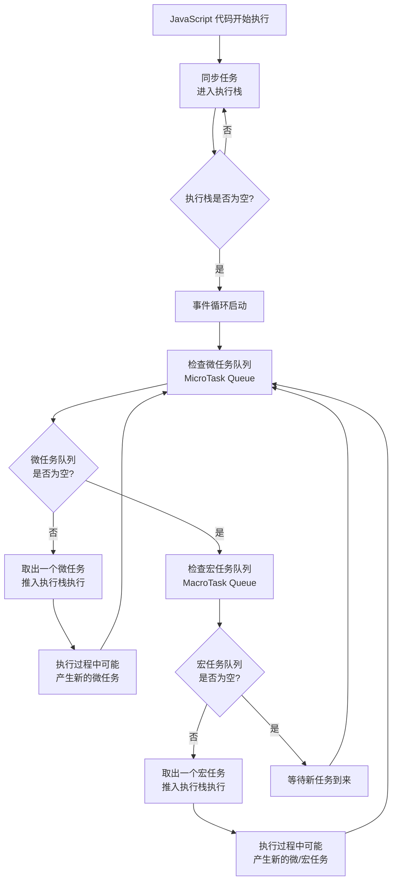

JavaScript 引擎的任务调度机制是其实现**单线程非阻塞异步编程**的核心，它通过**事件循环（Event Loop）** 来协调同步任务、异步宏任务和异步微任务的执行。下面我用一个流程图帮你快速概览其整体工作过程，然后再逐一解释关键概念和细节。



上图展示了事件循环的核心流程，其关键在于：**每当执行栈清空时，事件循环会优先清空微任务队列，然后才检查并执行一个宏任务**。这种机制保证了微任务具有更高的优先级。

### 🔍 理解任务类型

JavaScript 中的任务主要分为以下几种类型，它们的执行优先级不同：

| **任务类型**   | **常见例子**                                                           | **执行时机与特点**                                                 |
| :------------- | :--------------------------------------------------------------------- | :----------------------------------------------------------------- |
| **同步任务**   | `console.log()`, 普通的函数调用                                        | 立即在主线程执行，会阻塞后续代码直到完成。                         |
| **异步微任务** | `Promise.then()`, `async/await`, `MutationObserver`                    | 在当前**宏任务**结束后、下一个**宏任务**开始前，**立即清空执行**。 |
| **异步宏任务** | `setTimeout()`, `setInterval()`, UI 渲染, I/O 操作, 事件监听（如点击） | 在每一轮**事件循环**中，**执行一个**宏任务。                       |

### ⚙️ 核心组件协作

任务调度过程依赖于几个核心组件的协同工作：

- **调用栈 (Call Stack)**：这是代码执行的地方，它是一个后进先出（LIFO）的栈结构。JavaScript 引擎会执行位于栈顶的任务。
- **任务队列 (Task Queue)**：这是一个先进先出（FIFO）的队列，用于存放等待执行的异步任务回调。它又细分为：
  - **宏任务队列 (MacroTask Queue)**：存放宏任务回调。
  - **微任务队列 (MicroTask Queue)**：存放微任务回调，拥有更高优先级。
- **事件循环 (Event Loop)**：它像一个永动的循环，不断地检查调用栈是否为空。一旦调用栈为空，事件循环就会首先检查微任务队列，并将其中的所有任务依次放入调用栈执行；**只有微任务队列完全清空后**，才会从宏任务队列中取出**一个**任务执行，然后再次检查微任务队列，如此循环。

### 📌 执行顺序案例

看一个例子来理解执行顺序：

```javascript
console.log("Script start"); // 同步任务

setTimeout(() => {
  console.log("setTimeout"); // 宏任务
}, 0);

Promise.resolve()
  .then(() => {
    console.log("Promise 1"); // 微任务
  })
  .then(() => {
    console.log("Promise 2"); // 微任务
  });

console.log("Script end"); // 同步任务
```

输出结果将是：

```
Script start
Script end
Promise 1
Promise 2
setTimeout
```

**原因解析**：

1.  同步任务 `console.log('Script start')` 和 `console.log('Script end')` 最先执行。
2.  接着，清空微任务队列，按顺序执行 `Promise` 的 `then` 回调，输出 `Promise 1` 和 `Promise 2`。
3.  最后，执行下一个宏任务（`setTimeout` 的回调），输出 `setTimeout`。

### 🚀 优化策略

理解任务调度机制有助于编写更高效的代码：

- **合理使用微任务**：对于需要高优先级、尽快执行的操作（如基于 Promise 的状态更新），可放入微任务队列，以避免被宏任务（如 UI 渲染或网络事件）延迟。
- **避免长任务**：单个宏任务或微任务执行时间过长会阻塞线程，导致页面卡顿或无响应。应将长任务拆解为多个小任务，或使用 `setTimeout` 等宏任务将其拆分，以便浏览器有机会响应用户交互和进行渲染。
- **善用 Web Workers**：将计算密集型任务（如图像处理、大数据计算）offload 到 Web Worker 线程中执行，避免阻塞主线程，从而提升应用响应速度。

### 💎 总结

JavaScript 引擎的任务调度是一个以**事件循环**为核心，协调**调用栈**、**微任务队列**和**宏任务队列**的循环过程。其**关键规则**是：**同步任务优先，异步微任务次之，异步宏任务最后，且每执行一个宏任务后都会清空整个微任务队列**。
